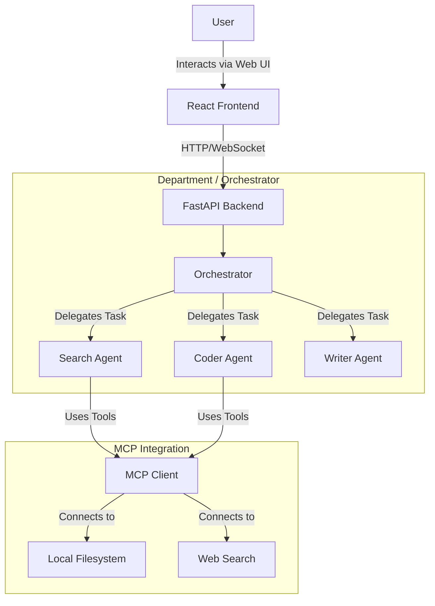

# Vendora

**Vendora** is a powerful Multi-Agent System designed to act as a cohesive "Department" of specialized agents. It integrates with the **Model Context Protocol (MCP)** to securely access local and remote tools, allowing agents to collaborate and solve complex problems autonomously.

## System Architecture



## Repository Structure

```text
Vendora/
├── multi-agent-system/     # Application: Hierarchical Multi-Agent Department
│   ├── agents/             # Root, Supervisors, and Workers
│   ├── mcp/                # MCP Integrations (Filesystem, etc.)
│   └── main.py             # Application Entry point
├── vendora/                # Framework: Mini-Agents Modules
│   └── README.md           # Framework documentation
├── examples/               # Usage Examples (e.g., MongoDB Agent)
├── tests/                  # System-wide Tests
├── scripts/                # Utility & Maintenance Scripts
├── frontend/               # React (Vite) Frontend
├── .github/                # CI/CD & GitHub Config
├── pyproject.toml          # Project Dependencies & Config
└── README.md               # Project Documentation
```


## Getting Started

### Prerequisites

- **Python 3.12+**
- **Node.js 20+**

### 1. Python Setup

Install the project with dependencies:

```bash
# Create and activate virtual environment
python -m venv venv
# Windows:
venv\Scripts\activate
# Mac/Linux:
# source venv/bin/activate

# Install Vendora in editable mode
pip install -e .[dev]
```
The API will be available at `http://localhost:8000`.

### 2. Frontend Setup

Navigate to the frontend directory and install dependencies:

```bash
cd frontend
npm install

# Start the Development Server
npm run dev
```
The Web UI will be available at `http://localhost:5173`.

### 3. Configuration

Copy `.env.example` to `.env` and fill in your API keys:

```bash
cp .env.example .env
```
