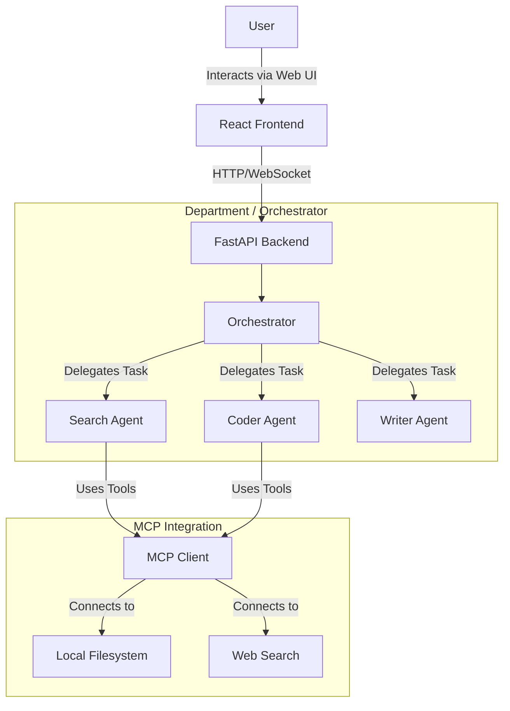

# Vendora

**Vendora** is a powerful Multi-Agent System designed to act as a cohesive "Department" of specialized agents. It integrates with the **Model Context Protocol (MCP)** to securely access local and remote tools, allowing agents to collaborate and solve complex problems autonomously.

## System Architecture



## Repository Structure

```text
Vendora/
├── .github/                # GitHub Configuration & Workflows
├── multi-agent-system/     # Python Multi-Agent System
│   ├── agents/             # Hierarchical Agents (Root, Supervisors, Workers)
│   ├── mcp/                # MCP Integrations
│   ├── memory/             # Agent Memory
│   ├── llm/                # LLM Client & Cost Estimator
│   ├── orchestration/      # Graph & State
│   ├── config/             # Configuration (Budgets)
│   ├── main.py             # API Entry point
│   └── requirements.txt    # Python dependencies
├── frontend/               # React (Vite) Frontend
│   ├── src/                # Source code
│   └── package.json        # Node dependencies
└── .env.example            # Environment variables template
```


## Getting Started

### Prerequisites

- **Python 3.12+**
- **Node.js 20+**

### 1. Backend Setup

Navigate to the `multi-agent-system` directory and set up the virtual environment:

```bash
cd multi-agent-system
python -m venv venv

# Activate Virtual Environment
# Windows:
venv\Scripts\activate
# Mac/Linux:
# source venv/bin/activate

# Install Dependencies
pip install -r requirements.txt

# Run the Server
python main.py
```
The API will be available at `http://localhost:8000`.

### 2. Frontend Setup

Navigate to the frontend directory and install dependencies:

```bash
cd frontend
npm install

# Start the Development Server
npm run dev
```
The Web UI will be available at `http://localhost:5173`.

### 3. Configuration

Copy `.env.example` to `.env` and fill in your API keys:

```bash
cp .env.example .env
```
